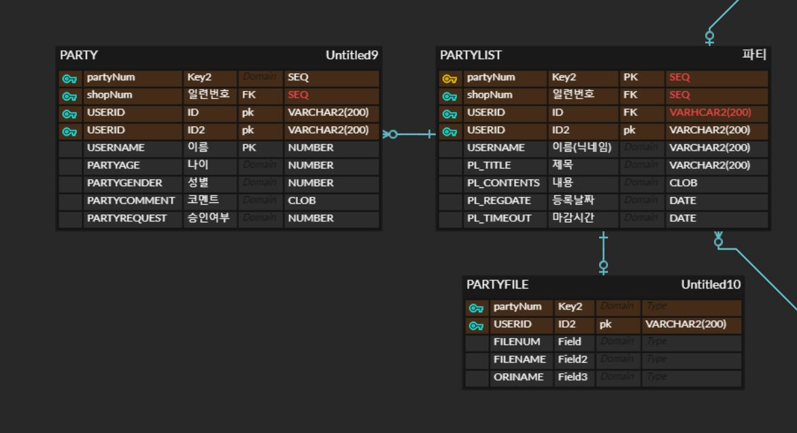

# PORTFOLIO

## 📗 목차

- [개요](#포트폴리오-개요)
- [설계](#설계/개발)
- [기능 구현](#기능-구현)
- [고려 사항](#고려-사항)
- [프로젝트 후기](#프로젝트-후기)

## **포트폴리오 개요**

> **프로젝트:** 맛집 리뷰 사이트
>
> **분류:** 팀 프로젝트[4명]
>
> **제작 기간:** 2022.09 ~ 2022.10
>
> **개발 목표** 
> 학원 수강시 학원 근처의 맛있는 음식점들의 정보공유 및 번개모임 등 여러 기능을 활용하는 커뮤니티형 웹 사이트
> 리뷰, 채팅, 대댓글 등 커뮤니티의 기능들을 구현했다
>
> **담당 기능:** 번개 모임 모집 글 작성, 리스트, 채팅 등 관련 기능
>
> **사용 기술 및 도구** 
> 
> 기반  :     
> 
> 프론트 :   
>
> 백     :   
>
>

## **설계/개발**
- #### 기능 구조
* Diagram

* 전체 ERD

* 담당 ERD

## **기능 구현**

#### 모집 리스트

- 검색 기능 (제목, 글쓴이, 내용)
- 글 갯수 5개 당 1페이지로 페이징 처리

#### 모집 글쓰기

- 모집 가능한 글 작성 기능
- 데이터 피커를 통해 원하는 날짜와 시간을 입력
(글 내용 입력은 summernote)

#### 파티 모집

- 디테일 페이지 진입 시 게시글 수정, 삭제 기능
- 해당 파티에 모집 신청시 코멘트 입력후 신청(나머지 정보 자동입력)
- 파티목록에서 체크박스를 통해 해당 신청에 수락, 거절 가능
(해당 기능은 주최자 외에는 사용할 수 없음)
- 수락이 여부 변경되며 거절이 해당 신청 삭제

#### 인원들과의 채팅

- 해당 파티에 채팅방에 입장하여 채팅 가능

## **고려 사항**
* 게시글 관련 기능을 만들시 중복입력(더블클릭)을 방지하는 기능 등 디테일한 사항들
* DB SELECT, INSERT등 쿼리문과 Ajax를 병행하여 사용할시 브라우저의 작동 방식을 이해해야함

## **프로젝트 후기**
첫 프로젝트로서 웹 사이트라는 주제를 가지고 만들어본 내 첫 작품이지만 여러모로 아쉬운점이 많다. 기능 구현은 고사하고 스케쥴 관리하며 개발을 해내는게 쉽지가 않았다. 더군다나 팀장으로 조원들과 조율하며 진행하는것도 쉽지않았다. 왜 WBS등을 기획하며 계획적으로 개발을 진행하는지 몸소 느끼게 되었다.
해당 프로젝트는 학원에서 배운 능력치들의 대부분을 구현했으며 추가적인 웹소켓도 사용하며 기능적으로는 만족스러우나 다음부터는 조금 체계적인 계획을 세울 필요성이 있겠다.
